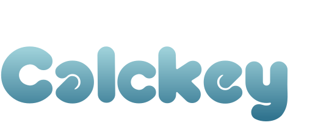

<div align="center">

[](https://liberapay.com/emtk)
[](https://codeberg.org/emtkmkk/calckey/)



**🌎 **Calckey** は永続的に自由に使える、オープンソースの分散型SNSプラットフォームです！ 🚀**

[](https://nogithub.codeberg.page/)
[](https://ci.codeberg.org/calckey/calckey)
[](https://liberapay.com/emtk)
[](https://hosted.weblate.org/engage/calckey/)
[](https://hub.docker.com/r/thatonecalculator/calckey)
[](./CODE_OF_CONDUCT.md)
[](https://codeberg.org/calckey/calckey/)

</div>

<div>


# ✨ Calckeyについて

Calckey は Misskey をベースにした分散型のマイクロブログサーバーです。mkkey は Calckey/Firefish 系の派生として運用しています。

- **Calckey / Firefish はメンテナンスが終了しています。このため本リポジトリの利用は推奨しません。**
- mkkey は [mkkey.net](https://mkkey.net) の運用向けフォークです。
- 変更内容 / リリースノート: [patchnote.md](./patchnote.md)
- フォーク元との差分メモ: [CALCKEY.md](./CALCKEY.md)
- 運用向けの調整が中心で、コミットが散らかり気味です。必要があれば [emtk@mkkey.net](https://mkkey.net/@emtk) に連絡してください。

- Calckey は ActivityPub に対応した高機能マイクロブログサーバーで、絵文字リアクション、カスタマイズ可能なWeb UI、豊富なチャット機能などを備えています。
- Calckey はユーザーと管理者の双方に向けた改善やバグ修正を数多く取り込んでいます。
- 現在・今後の差分については **[CALCKEY.md](./CALCKEY.md)** を参照してください。
- 主な特徴:
  - 改善された UI/UX（特にモバイル）
  - 改善された通知
  - インスタンスのセキュリティ強化
  - アクセシビリティ向上
  - スレッド表示の改善
  - おすすめインスタンスタイムライン
  - OCR による画像キャプション
  - 新しいグループ機能
  - 改善された導入チュートリアル
  - Mastodon クライアント/アプリとの互換性
  - ユーザー情報の補完
  - Sonic 検索
  - 多数のユーザー/管理者向け設定
  - [さらに詳しく](./CALCKEY.md)

</div>

<div style="clear: both;"></div>

# 🥂 リンク

- 💸 Liberapay: <https://liberapay.com/emtk>
- 💁 Matrix サポートルーム: <https://matrix.to/#/#calckey:matrix.fedibird.com>
- 📜 インスタンス一覧: <https://calckey.fediverse.observer/list>
- 📖 JoinFediverse Wiki: <https://joinfediverse.wiki/What_is_Calckey%3F>
- 🐋 Docker Hub: <https://hub.docker.com/r/thatonecalculator/calckey>
- ✍️ Weblate: <https://hosted.weblate.org/engage/firefish/>
- 📦 Yunohost: <https://github.com/YunoHost-Apps/calckey_ynh>

# 🌠 はじめに

この手順はフォーク元の案内を日本語化したものです。mkkey の運用環境に合わせて適宜読み替えてください。

このガイドは **新規構築** と **Misskey からの移行** の両方に対応しています。

## 🔰 簡易インストーラー

以下のインストーラーが使える環境であれば、利用を推奨します。これらの方法では、Misskey からの移行は手動対応が必要です。

[](https://codeberg.org/calckey/ubuntu-bash-install)　　[](https://aur.archlinux.org/packages/calckey)　　[](https://install-app.yunohost.org/?app=calckey)

## 🛳️ コンテナ運用

- [🐳 DockerでCalckeyを動かす](https://codeberg.org/calckey/calckey/src/branch/develop/docs/docker.md)
- [🛞 Kubernetes/HelmでCalckeyを動かす](https://codeberg.org/calckey/calckey/src/branch/develop/docs/kubernetes.md)

## 🧑‍💻 依存関係

運用に必要な主要依存関係です。バージョンは上流の基準を踏襲しています。

- 🐢 [NodeJS](https://nodejs.org/en/) v18.12.1 以上（v19 推奨）
  - [nvm](https://github.com/nvm-sh/nvm) での導入を推奨
- 🐘 [PostgreSQL](https://www.postgresql.org/) v12 以上
- 🍱 [Redis](https://redis.io/) v6 以上（v7 推奨）
- Web プロキシ（以下のいずれか）
  - 🍀 Nginx（推奨）
  - 🪶 Apache
  - 🦦 Caddy

### 😗 オプション依存

- 動画トランスコード用の [FFmpeg](https://ffmpeg.org/)
- 全文検索（以下のいずれか）
  - 🦔 [Sonic](https://crates.io/crates/sonic-server)（推奨）
  - [ElasticSearch](https://www.elastic.co/elasticsearch/)

### 🏗️ ビルド依存

ビルド時に必要な依存関係です。

- 🦀 [Rust toolchain](https://www.rust-lang.org/)
- 🦬 C/C++ コンパイラ & ビルドツール
  - Debian/Ubuntu: `build-essential`
  - Arch Linux: `base-devel`
- 🐍 [Python 3](https://www.python.org/)

## 👀 作業フォルダの準備

```sh
git clone --depth 1 https://github.com/emtkmkk/mkkey.git
cd mkkey/
```

必要に応じてブランチを切り替えてください。

## 📩 依存関係のインストール

```sh
# nvm install 19 && nvm use 19
corepack enable
corepack prepare pnpm@latest --activate
# TensorFlowなしでビルドする場合は --no-optional を付与
pnpm i # --no-optional
```

### pm2

pm2 を導入する場合は以下を実行します。

```
npm i -g pm2
pm2 install pm2-logrotate
```

[`pm2-logrotate`](https://github.com/keymetrics/pm2-logrotate/blob/master/README.md) はログ肥大化を防ぐために有効です。

## 🐘 データベース作成

PostgreSQL のセットアップが済んでいる前提で、以下を実行します。

```sh
psql postgres -c "create database calckey with encoding = 'UTF8';"
```

`.config/default.yml` の `db` セクションに、作成したデータベース情報を設定してください。

## 🦔 検索のセットアップ

Sonic の [インストールガイド](https://github.com/valeriansaliou/sonic#installation) に従ってください。

IPv4 を使う場合は、Sonic の `config.cfg` の `inet` を `"0.0.0.0:1491"` に変更します。

`.config/default.yml` の `sonic` セクションに設定を反映してください。


## 💅 カスタマイズ

mkkey の運用に合わせてカスタムする場合の入口です。

- 全ユーザー向けのカスタムCSSは `./custom/assets/instance.css` を編集します。
- スプラッシュ画像などの静的アセットは `./custom/assets/` に置くと、`https://yourinstance.tld/static-assets/filename.ext` で配信されます。
- カスタムロケールは `./custom/locales/` に配置します。既存ロケールと同名にすると上書きされ、ユニーク名の場合は追加されます。ファイル名の先頭はベースにするロケール名に合わせてください。（例: `en-FOO.yml`）
- カスタムエラー画像は `./custom/assets/badges` に配置します（既存ファイルを置換）。
- カスタムサウンドは `./custom/assets/sounds` に mp3 のみ配置します。
- ビルドせずにカスタムアセットを更新する場合は `pnpm run gulp` を実行します。

## 🧑‍🔬 新規インスタンス設定

新規インスタンス向けの基本設定です。

- `cp .config/example.yml .config/default.yml` を実行
- `.config/default.yml` を編集し、必須項目を入力
- Docker を使う場合は `.config/docker_example.env` を `.config/docker.env` にコピーして編集

## 🚚 Misskeyからの移行

Misskey v13/v12 や Foundkey からの移行については [移行ドキュメント](https://codeberg.org/calckey/calckey/src/branch/develop/docs/migrate.md) を参照してください。

## 🌐 Webプロキシ

### 🍀 Nginx（推奨）

- `sudo cp ./calckey.nginx.conf /etc/nginx/sites-available/ && cd /etc/nginx/sites-available/`
- `calckey.nginx.conf` をインスタンスに合わせて編集
- `sudo ln -s ./calckey.nginx.conf ../sites-enabled/calckey.nginx.conf`
- `sudo nginx -t` で設定を検証し、NGINX を再起動

### 🪶 Apache

- `sudo cp ./calckey.apache.conf /etc/apache2/sites-available/ && cd /etc/apache2/sites-available/`
- `calckey.apache.conf` をインスタンスに合わせて編集
- `sudo a2ensite calckey.apache` でサイトを有効化
- `sudo service apache2 restart` で設定を反映

### 🦦 Caddy

- `Caddyfile` に以下を追加し、`example.tld` を自分のドメインに置き換えてください:
```caddy
example.tld {
    reverse_proxy http://127.0.0.1:3000
}
```
- Caddy を再読み込み

## 🚀 ビルドと起動

ビルドと起動手順です。

### 🐢 NodeJS + pm2

#### 今後の更新時は `git pull` してから以下を実行します

```sh
# git pull
pnpm install
NODE_ENV=production pnpm run build && pnpm run migrate
pm2 start "NODE_ENV=production pnpm run start" --name Calckey
```

## 😉 小ネタ

- 設定ファイル末尾の項目はマネージドホスティング向けのため、セルフホストでは未入力推奨です。これらはコントロールパネルで設定するのが適切です。
- デフォルトの 3000 番ポートが他の用途で使われている場合があります。空いているポートを探すには `for p in {3000..4000}; do ss -tlnH | tr -s ' ' | cut -d" " -sf4 | grep -q "${p}$" || echo "${p}"; done | head -n 1` を実行してください。必要に応じて範囲を調整します。
- 特に Docker 利用時は、オブジェクトストレージに S3 バケット/CDN を使うことを推奨します。
- Cloudflare の利用は非推奨ですが、使う場合はコード最小化を無効にしてください。
- Push 通知を使う場合は `npx web-push generate-vapid-keys` を実行し、公開鍵/秘密鍵を「コントロールパネル > 全般 > ServiceWorker」に設定します。
- 翻訳機能を使う場合は [DeepL](https://deepl.com) アカウントで API キーを取得し、「コントロールパネル > 全般 > DeepL 翻訳」に設定します。
- 管理者アカウントを追加する場合:
  - ユーザーページ > 3点メニュー > About > Moderation で「Moderator」を有効化
  - Overview に戻り、ID 横のクリップボードアイコンで ID をコピー
  - `psql -d calckey`（DB名が異なる場合は置き換え）
  - `UPDATE "user" SET "isAdmin" = true WHERE id='999999';`（`999999` をコピーした ID に置き換え）
  - 対象ユーザーが一度ログアウト後に再ログイン
