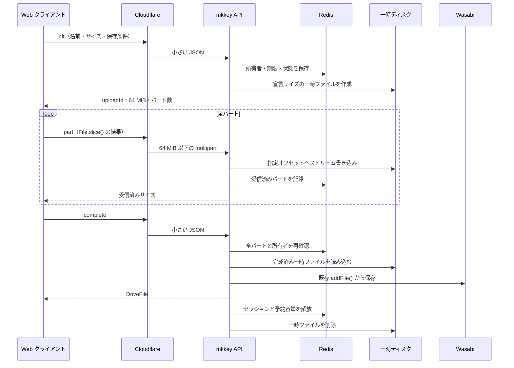

# 分割アップロード実装計画

## 概要

Cloudflare の 1 リクエスト 100 MB 制限より大きいファイルを、公式 Web クライアントから Drive へアップロードできるようにする。

小さいファイルは既存の [`drive/files/create`](../packages/backend/src/server/api/endpoints/drive/files/create.ts) を維持し、大きいファイルだけを複数リクエストへ分割する。全パートの受信後は既存の [`addFile()`](../packages/backend/src/services/drive/add-file.ts) に渡し、MIME 検出、ハッシュ、重複判定、ドライブ容量判定、センシティブ判定、動画サムネイル生成、Wasabi への保存を変更しない。

## 配置と構成

| ファイル | 役割 |
| --- | --- |
| [`packages/client/src/scripts/upload.ts`](../packages/client/src/scripts/upload.ts) | ファイルサイズによる経路選択、パート分割、全体進捗の集約 |
| `packages/backend/src/services/drive/chunked-upload.ts` | セッション、Redis、パート書き込み、一時ファイル、完了・中止処理を集約 |
| `packages/backend/src/server/api/endpoints/drive/files/upload/init.ts` | セッションを開始し、サーバが決めたパートサイズを返す |
| `packages/backend/src/server/api/endpoints/drive/files/upload/part.ts` | 1 パートを受信する |
| `packages/backend/src/server/api/endpoints/drive/files/upload/complete.ts` | 全パートを確認し、既存の Drive 登録処理を実行する |
| `packages/backend/src/server/api/endpoints/drive/files/upload/abort.ts` | セッションと一時ファイルを明示的に削除する |
| [`packages/backend/src/server/api/index.ts`](../packages/backend/src/server/api/index.ts) | エンドポイントごとの受信ファイル上限を適用できるようにする |
| [`packages/backend/src/server/api/endpoints.ts`](../packages/backend/src/server/api/endpoints.ts) | 新規 API の登録 |
| [`packages/backend/src/daemons/janitor.ts`](../packages/backend/src/daemons/janitor.ts) | 期限切れ分割アップロードの一時ファイルを削除する |
| [`packages/calckey-js/src/api.types.ts`](../packages/calckey-js/src/api.types.ts) | JSON API の要求・応答型を追加する |
| `locales/*.yml` | 失敗、期限切れなどの表示文言を追加する |

## 方針メモ

### 判断の軸

迷ったら、既存のファイル検査・保存結果との互換性と、サーバのディスクを使い切らせないことを優先する。

### 初版の推奨値

| 項目 | 値 | 理由 |
| --- | --- | --- |
| 分割へ切り替えるサイズ | 90 MiB 以上 | 100 MB 制限に multipart の付加情報を含めても余裕を持たせる |
| 1 パート | 64 MiB | Cloudflare 制限から十分に小さく、最大 250 MiB を 4 リクエストに抑えられる |
| 同時送信数 | 1 | 初版では進捗・サーバ書き込みの競合を単純化する |
| セッション有効期限 | 最終操作から 24 時間 | 低速回線を許容しつつ、放置データを回収する |
| ユーザーごとの進行中セッション | 最大 2 | 一時ディスクの予約濫用を抑える |
| サーバ全体の予約上限 | 8 GiB | 本番の一時領域とアプリが同じ 99 GB ボリュームを使うため、他用途の空きを十分に残す |

パートサイズとパート数は `init` 応答でサーバから返す。分割へ切り替えるしきい値は、初版ではクライアントとサーバの両方で 90 MiB に固定し、設定項目は増やさない。

## 設計方針

### 一時ファイル

- OS の一時ディレクトリ配下に `mkkey-chunked-upload/<uploadId>/data` を作る。
- `uploadId` は推測困難な UUID とし、パスへユーザー入力を含めない。
- `init` で宣言サイズまでファイルを作り、各パートを `partNumber * chunkSize` の位置へストリームで書く。
- パート全体を Node.js のメモリへ読み込まない。
- Multer が作ったパート用一時ファイルは、書き込み成功・失敗のどちらでも削除する。
- 完了・中止・期限切れでディレクトリ全体を削除する。

### セッション状態

- Redis に所有ユーザー、宣言サイズ、ファイル名、保存先、パート数、受信済みパート、状態、期限を保持する。
- すべての API で `uploadId` の所有者が認証ユーザーと一致することを確認する。
- クライアントからの自動再送は行わない。ただし、同じ `(uploadId, partNumber)` を重複受信してもファイルを破損させない。
- `complete` と `part` の競合を避けるため、アップロード単位の Redis ロックを使う。

### サイズとディスク保護

- `init` で `config.maxFileSize` を超える宣言を拒否する。
- `part` はサーバが返したパートサイズと、最終パートの期待サイズに完全一致する場合だけ受け付ける。
- エンドポイントメタにファイル上限を持たせ、Multer 自体でも 64 MiB を少し超えた時点で停止する。
- ユーザー単位の進行中セッション数に加え、サーバ全体の予約バイト数にも上限を設ける。
- Redis の TTL だけではディスク上のファイルが消えないため、master の janitor がディレクトリの更新時刻も確認して削除する。
- Redis 障害時は新規セッションを開始せず、所有者や受信済み状態を確認できないパートも受け付けない。

### クライアント

- 既存の画像圧縮とファイル名確認を先に済ませ、実際に送る `File` のサイズで経路を決める。
- 分割時は `File.slice()` を使い、元ファイル全体を ArrayBuffer に読み込まない。
- 進捗は `送信済みパートの合計 + 現在のパートの loaded` として、既存アップロード表示へ反映する。
- 最後のパート送信後に `processing` へ切り替え、既存の `driveFileProgress` を使って `addFile()` の進捗を表示する。
- いずれかのパートが失敗した時点でアップロード全体を失敗として扱い、`abort` を試みる。通信断で届かなくても janitor が回収する。

## 機能一覧

| 機能 | 実装方法 | 使用する方式 |
| --- | --- | --- |
| Cloudflare 上限回避 | ファイルを複数 HTTP リクエストへ分割 | `Blob.slice()` + multipart POST |
| 複数 Web ワーカー対応 | 状態をプロセスメモリに置かない | Redis + 同一ホストの一時ディスク |
| 最終ファイル検査 | 完成した一時ファイルを既存処理へ渡す | `addFile()` |
| 放置データの回収 | TTL とディスク走査を併用 | Redis + janitor |

## 非実装

| 項目 | 初版で実装しない理由 |
| --- | --- |
| 動画のクライアント圧縮 | 分割アップロードの安定性を先に確立するため |
| パートの自動再送 | 現行アップロードと同じ失敗時の挙動を維持し、初版の状態管理を単純にするため |
| ページ再読み込み後の自動再開 | ブラウザは元の `File` を安全に復元できず、IndexedDB へ巨大ファイルを複製すると負荷が大きいため |
| 並列パート送信 | 250 MiB 上限では直列でもリクエスト数が少なく、初版の競合を減らす効果を優先するため |
| Mastodon API と外部クライアント | 新しいプロトコルを知らないため。既存 `drive/files/create` は残す |
| Wasabi へのクライアント直接送信 | 既存の検査・保存処理を大きく変えないことを優先するため |
| 250 MiB を超えるファイル | 現在の `maxFileSize` と Drive 仕様を変更する別課題になるため |

## 決定事項

| 項目 | 決定 |
| --- | --- |
| 主方式 | クライアント分割、mkkey サーバの一時ファイルへ結合 |
| 小さいファイル | 既存 `drive/files/create` を維持 |
| 保存前処理 | 既存 `addFile()` を必ず通す |
| 既存クライアント | 従来 API を残して互換性を維持 |
| 動画圧縮 | 初版の対象外 |
| 通信失敗時 | 自動再送せず、アップロード全体を失敗として中止 |
| ページ再読み込み後 | 再開しない |

## 初版で固定した運用値

| 項目 | 決定 | 影響 |
| --- | --- | --- |
| サーバ全体の予約上限 | 8 GiB をサーバ定数として使用 | 設定面を増やさず、一時ディスクの予約濫用を抑える |
| 分割機能の有効化方式 | 公式 Web クライアントで常時有効 | Cloudflare を使わない環境でも結果は同じだが、大きいファイルは複数リクエストになる |

## 実装手順

1. 分割アップロードの定数、セッション型、Redis キー、一時パス、ロック処理を `chunked-upload.ts` に実装する。
2. `init` と `abort` を追加し、サイズ・所有者・同時セッション・予約容量を検証する。
3. エンドポイント固有の Multer 上限を追加し、`part` をストリーム書き込みと安全な重複受信に対応させる。
4. `complete` を追加し、全パート確認、競合防止、`addFile()` 呼び出しを実装する。
5. janitor に期限切れ一時ディレクトリの回収を追加する。
6. エンドポイント一覧と API 型へ分割機能の情報を追加する。
7. クライアントに経路選択、直列パート送信、全体進捗、失敗時の中止処理を追加する。
8. エラー文言をローカライズし、設定例へ一時ディスク要件を追記する。
9. 正常系、境界値、重複パート、欠損、別ユーザー、期限切れ、ディスク上限をテストする。
10. 型チェック、クライアントビルド、Linux 側 lint・backend ビルドを実行し、既知のベースラインと比較する。
