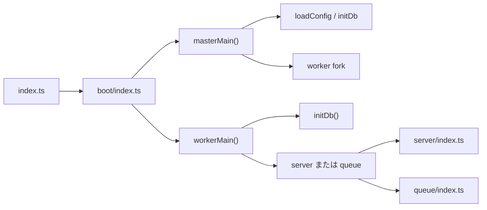

# Cluckey 開発ドキュメント

このページは、`mkkey` のローカル開発を始めるための最短手順です。

## 1. 前提ソフト

- Node.js
- pnpm（corepack 推奨）
- PostgreSQL
- Redis

Nix 環境を使う場合は、既存の `flake.nix` / `devenv` 構成も利用できます（x86_64-linux で検証）。手順は次のとおりです。

1. [Nix](https://nixos.org/download.html) と [direnv](https://direnv.net/docs/installation.html) を入れ、シェルに direnv の hook を追加する。
2. リポジトリで `direnv allow` を実行し、開発用シェルを有効にする。
3. `devenv run install-deps` で依存を入れ、`devenv run prepare-config` で `.config/devenv.yml` を `.config/default.yml` にコピーする。
4. `.config/default.yml` の `db` / `redis` / `url` を編集する（devenv の Redis/PostgreSQL を使う場合はそのままでも可）。
5. `devenv up` を実行すると Redis / Postgres / 開発サーバーが起動する。初回は別ターミナルで `devenv run migrate` を実行する。
6. ブラウザで [http://localhost:3000](http://localhost:3000) を開く。初回は管理者作成画面が出る。
7. 開発サーバーを再開するときは、`devenv up` を再度実行すればよい（または Node 手順の場合は `pnpm run dev`）。

## 2. リポジトリ準備

```sh
git clone https://github.com/emtkmkk/mkkey.git
cd mkkey
corepack enable
corepack prepare pnpm@latest --activate
pnpm install
```

## 3. 設定ファイル作成

```sh
cp .config/example.yml .config/default.yml
```

`default.yml` の `db` / `redis` / `url` を開発環境に合わせて編集します。

## 4. 初期化と起動

```sh
pnpm run migrate
pnpm run dev
```

通常は `http://localhost:3000` で確認できます。

## 5. よく使うコマンド

- まとめてビルド: `pnpm run build`
- フォーマット: `pnpm run format`
- Lint: `pnpm run lint`
- テスト: `pnpm run test`

## 6. 補足

- 静的アセット更新だけ反映したい場合は `pnpm run gulp` が使えます。
- DB を作り直す場合は、先にバックアップを取ってから作業してください。
- Nix 環境が使えない、または未整備の場合は、上記の Node.js + pnpm 手順（2〜4、`pnpm run migrate` と `pnpm run dev`）を利用してください。

## 7. リポジトリ・パッケージ構成

- **ルート**: pnpm ワークスペース構成です。ルートの `package.json` の `dev` は `scripts/dev.js` を実行します。
- **開発用スクリプト**: `scripts/dev.js` は、ざっくり次の流れで開発環境を立ち上げます。
  - `pnpm clean` を実行してビルド成果物を掃除
  - 並列で `gulp watch` / `backend watch` / `client watch` / `sw watch` を起動
  - 最後に `pnpm start`（= backend の `start`）でバックエンドサーバーを起動
- **主なパッケージ**:
  - **backend** (`packages/backend`): サーバー・API・キュー・ActivityPub・DB を含むバックエンド。エントリポイントは `src/index.ts`。
  - **client**: Web フロントエンド（Vue など）。ビルド結果は gulp によってバックエンド側にまとめられます。
  - **sw**: Service Worker。プッシュ通知や通知バッジなどを扱います。
  - **calckey-js**: バックエンドなどから参照される共通ライブラリです。

## 8. 起動フロー（バックエンド）

バックエンドのプロセス起動は、おおまかに次のような流れです。



- **`src/index.ts`**: `boot()` を呼ぶだけのエントリポイントです。`EventEmitter.defaultMaxListeners` や `Error.stackTraceLimit` を設定します。
- **`boot/index.ts`**:
  - `cluster.isPrimary` なら `masterMain()`、worker なら `workerMain()` を呼び出します。
  - `envOption.disableClustering` が有効な場合は、単一プロセスで両方を実行します（テストなど）。
- **`boot/master.ts`**:
  - 設定読み込み（`config/load.ts`）と DB 初期化（`initDb`）を行い、
  - 必要に応じてワーカープロセスを fork します。
- **`boot/worker.ts`**:
  - `initDb()` 実行後、`process.env.mode` が未設定または `web` の場合は `server/index.ts` を起動し、
  - `process.env.mode` が `queue` の場合は `queue/index.ts` を起動します。
- **主な環境変数**:
  - `NODE_ENV`: `test` のときはクラスタ無効・daemon 無効など、テスト用の挙動になります。
  - `mode`: `"web"` / `"queue"` で、ワーカーがサーバー専用かキュー専用かを切り替えます。
  - `MK_〜` 環境変数: [backend/src/env.ts](packages/backend/src/env.ts) で定義されたオプション（`onlyQueue`, `noDaemons`, `slow` など）を有効化します。

## 9. バックエンドのフォルダ構造（packages/backend/src）

バックエンドのディレクトリ構成と大まかな役割は次の通りです。

| フォルダ         | 役割                                                                                       |
| ------------ | ---------------------------------------------------------------------------------------- |
| **boot**     | エントリ後の起動制御。master/worker の分岐・設定読み込み・DB 初期化・クラスタ制御。                         |
| **config**   | 設定ファイル（YAML）の読み込みと Config 型。`load.ts` が `.config/default.yml` を読み込みます。            |
| **const**    | アプリ全体で使う定数（文字数制限・ファイル種別など）。                                                              |
| **daemons**  | 定期実行のバックグラウンド処理（janitor, health-stats, server-stats, queue-stats, delayed-retry-sync 等）。 |
| **db**       | PostgreSQL（TypeORM DataSource）と Elasticsearch の初期化。`postgre.ts` がメインの接続を定義します。  |
| **mfm**      | Misskey Flavored Markdown の HTML 変換（`from-html.ts`, `to-html.ts`）。                         |
| **misc**     | 汎用ユーティリティ（fetch, cache, schema, password, i18n、認証・可視性まわり等）。                             |
| **models**   | エンティティ定義（entities）・リポジトリ（repositories）・API 用スキーマ（schema）。                                |
| **prelude**  | 配列・URL 等の共通ヘルパ。                                                                          |
| **queue**    | Bull キュー初期化・キュー名定義（`queues.ts`）・各 processor（deliver, inbox, db, system, webhook 等）。        |
| **remote**   | ActivityPub 周り（inbox/outbox 処理、perform, resolver, deliver-manager, renderer 等）。          |
| **server**   | HTTP サーバ本体。api（REST + Mastodon 互換）・file・proxy・web・activitypub・nodeinfo・well-known・ストリーミング。 |
| **services** | ドメイン処理のまとまり（note, follow, drive, chart, blocking, notification 等）。API やキューから呼ばれます。    |

よく参照するファイルの例:

- エントリ: `src/index.ts`, `boot/index.ts`, `boot/master.ts`, `boot/worker.ts`
- サーバ: `server/index.ts`, `server/api/index.ts`
- API 定義: `server/api/endpoints.ts`, `server/api/define.ts`
- キュー: `queue/index.ts`, `queue/queues.ts`, `queue/types.ts`
- 設定: `config/load.ts`, `.config/default.yml`

## 10. サーバー・ルーティング概要

HTTP サーバー（Koa）は [packages/backend/src/server/index.ts](packages/backend/src/server/index.ts) で組み立てられます。

- **マウントされるサーバー**:
  - `/api` → [api/index](packages/backend/src/server/api/index.ts)（REST API + Mastodon 互換ルート）
  - `/files` → [file/index](packages/backend/src/server/file/index.ts)（ドライブファイル配信・ダミー画像）
  - `/proxy` → [proxy/index](packages/backend/src/server/proxy/index.ts)（メディアプロキシ）
- **ルーターで直接扱うルート**（`activityPub`, `nodeinfo`, `wellKnown` を使ったあと）:
  - `/avatar/@:acct`, `/avatar-alt/@:acct`, `/identicon/:x`, `/missing` などのアバター/プレースホルダー画像系
  - Mastodon 互換: `/oauth/authorize`, `/oauth/token` など（`mastoRouter`）
- **Web クライアント**:
  - 最後に `mount(webServer)` で Web クライアント（SSR・静的ファイル・OGP・管理画面等）をルート以下にマウントします。
- **ストリーミング**:
  - `initializeStreamingServer(server)` で同一 HTTP サーバに WebSocket を追加し、MainStreamConnection が各種チャンネル（homeTimeline, globalTimeline 等）を扱います。

## 11. API とキュー（概要）

- **API**:
  - [server/api/endpoints.ts](packages/backend/src/server/api/endpoints.ts) で「API パス」とエンドポイントモジュールの対応を定義しています（例: `\"notes/create\"` → `endpoints/notes/create.ts`）。
  - 各エンドポイントは `define({ meta, params, res, execute })` でメタ情報・パラメータスキーマ・レスポンススキーマ・実処理を登録します。
  - 認証は [api/authenticate](packages/backend/src/server/api/authenticate.ts) が担当し、実行は [api-handler](packages/backend/src/server/api/api-handler.ts) → [call](packages/backend/src/server/api/call.ts) という流れになります。
  - OpenAPI 仕様は [openapi/gen-spec](packages/backend/src/server/api/openapi/gen-spec.ts) で自動生成され、API ドキュメント表示などに使われます。
- **キュー**:
  - [queue/queues.ts](packages/backend/src/queue/queues.ts) で `deliver` / `inbox` / `db` / `system` / `webhookDeliver` / `background` / `noteApDeliver` などのキューを定義しています。
  - [queue/index.ts](packages/backend/src/queue/index.ts) で各キューに processor（`processors/deliver.ts`, `processors/inbox.ts` など）を登録し、Bull 経由で Redis 上のジョブを処理します。
  - ジョブの型定義は [queue/types.ts](packages/backend/src/queue/types.ts) にまとまっており、deliver/inbox などで使う payload の構造を確認できます。

## 12. 設定ファイル

- **設定ファイルの場所**:
  - `.config/default.yml` が通常の設定ファイルです（開発時は `cp .config/example.yml .config/default.yml` で作成）。
  - テスト時（`NODE_ENV=test`）は `.config/test.yml` があればそちらが使われます。
- **最低限編集する項目の例**:
  - `url`
  - `port`
  - `db.host` / `db.port` / `db.db` / `db.user` / `db.pass`
  - `redis.host` / `redis.port`
- **読み込み処理**:
  - [config/load.ts](packages/backend/src/config/load.ts) で YAML を読み込み、ビルドメタや環境変数とマージして `config` オブジェクトとして各所から参照できるようにしています。

## 13. 開発時のポイント（まとめ）

- **コマンドの入口**:
  - `pnpm run dev`: 開発サーバー＋各パッケージの watch をまとめて起動します（`scripts/dev.js` 参照）。
  - `pnpm run build` / `pnpm run migrate` / `pnpm run test`: ルートまたは backend で実行します。
- **静的アセットの更新**:
  - クライアントや静的ファイルの変更だけを反映したい場合は `pnpm run gulp` でビルドできます。
- **テストモード**:
  - `NODE_ENV=test` ではクラスタリング無効・daemon 無効など、テストしやすい設定になります（`env.ts` 参照）。
  - バックエンドのテストは主に `pnpm run test`（mocha）で実行します。
- **環境オプション**:
  - `MK_SLOW=1` で全体に遅延を入れる、`MK_NO_DAEMONS=1` で daemon を起動しない、などのオプションがあります（[packages/backend/src/env.ts](packages/backend/src/env.ts) を参照）。
